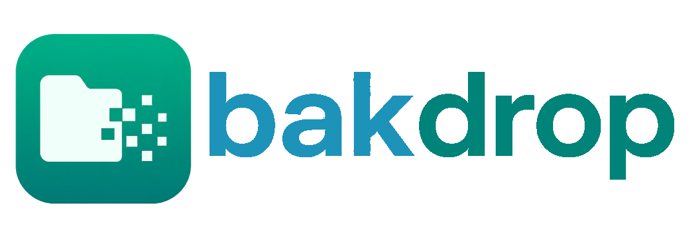

# Bakdrop



*Work in progress*

Simple file sharing web app for temporary file distribution.

Bakdrop (backup drop) is designed for administrators who need to share files temporarily with end users.

Main scenario is to share data restored from backups to end users by self-expiring link with option do auto-delete data after downloading.

## Features

- **Temporary share links** - Generate random links with optional expiration
- **Password protection** - Optionally protect links with passwords
- **Auto-deletion** - Files can be automatically deleted after download
- **Folder sharing** - Share entire folders (streamed as ZIP)
- **Multi-language** - English and Polish UI
- **Themes** - Dark and Light modes
- **Efficient streaming** - Large file support with chunked streaming and Range requests
- **Multi-user support** - Each user has their own isolated folder (but proper user management isn't completed yet)

## Requirements

- PHP 8.3+
- SQLite3
- Apache
- Composer (for ZipStream dependency)

## Installation

This section is not completed yet, it's draft for now. Docker installation tbd

#### 1. Clone or download

```bash
git clone https://github.com/yourusername/bakdrop.git
cd bakdrop
```

Or extract the ZIP file to your web server directory.

#### 2. Install dependencies

The application requires ZipStream library for folder downloads. Install it using Composer:

```bash
composer install
```

**Note:** `composer.json` and `composer.lock` are included in the package. This will install:
- `maennchen/zipstream-php` v3.2


#### 3. Configure

Edit `config.example.php` and rename it to `config.php`:

```php
define('DB_PATH', '/var/lib/bakdrop/shares.db');    // Database path, it will be created there
define('FILES_PATH', '/path-to-your-data-dir');      // Root directory for all files
define('BASE_URL', 'https://your-domain-or-ip');    // Base URL for share links
define('DEFAULT_LANG', 'en');                        // Default language for public pages (en, pl)
date_default_timezone_set('Europe/Warsaw');          // Timezone is used for showing expiration time in share links
```

#### 4. Set permissions


# Ensure web server can write to database and root file directory
```
chown www-data:www-data /path/to-your.db
chmod 755 .
```

#### 5. Initial setup

Navigate to `https://yourserver.com/setup.php` in your browser and create your first admin account.

## Usage

### For Administrators

1. **Login** - Navigate to `http://yourserver.com/auth.php`
2. **Browse files** - Navigate through your assigned folder
3. **Create share link**:
   - Click "Share" next to any file or folder
   - Optionally set expiration (1h, 24h, 7 days)
   - Optionally add password protection
   - Optionally enable auto-delete after download
4. **Copy link** - Share the generated link with end users
5. **Manage shares** - View active shares, download counts, and delete links

### For End Users

End users receive a share link (e.g., `http://yourserver.com/share.php?h=abc123def456`):

1. Click the link
2. Enter password if required
3. Download file or folder

## File Streaming

### Small files (<100MB)
- Streamed in 8MB chunks
- Support for Range requests (resumable downloads)

### Large files (>100MB)
- X-Sendfile (Apache) or X-Accel-Redirect (Nginx) if available
- Falls back to PHP streaming

### Folders
- On-the-fly ZIP creation using ZipStream
- No temporary files created
- Memory-efficient streaming
