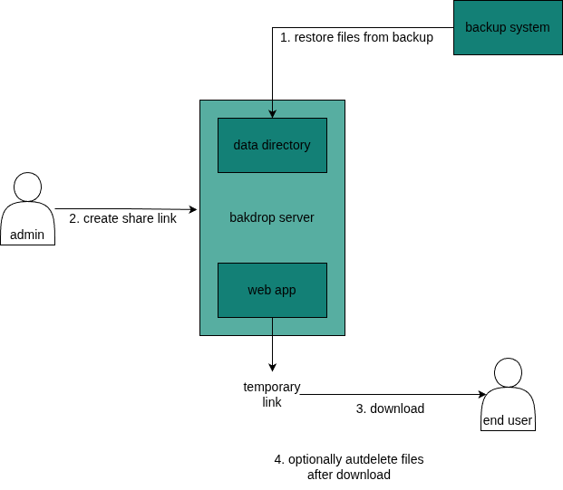
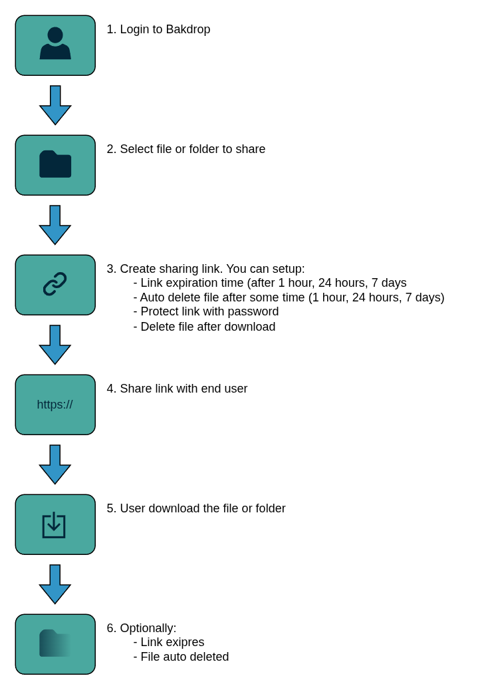

*Work in progress*

Bakdrop is simple web app for sharing files from server to end users by creating a unique download links.

The main scenario is to share data restored from backups to end users by self-expiring link with option do auto-delete data after downloading, but it can be used everywhere you need to share files from server.



The whole idea of bakdrop is just simple sharing files from your host. No users, permissions, fancy options - just link with option to download.

## Features

- **Temporary share links** - Generate random links with optional expiration
- **Password protection** - Optionally protect links with passwords
- **Auto-deletion** - Files can be automatically deleted after download or after some time (cron needed - script TBD)
- **Folder sharing** - Share entire folders (streamed as ZIP)
- **Efficient streaming** - Large file support with chunked streaming and range requests.

## Requirements

There are two options to install bakdrop - docker or manual installation.

### Docker
- Docker + Docker Compose

### Manual install
- PHP 8.3+
- SQLite3 extension for PHP
- Apache with mod_rewrite
- Composer (for ZipStream dependency)

## Installation

### Option A — Docker

#### 1. Clone the repository

```bash
git clone https://github.com/yourusername/bakdrop.git
cd bakdrop
```

#### 2. Prepare the files directory on the host

Bakdrop share files from a directory on the host machine (default: `/fsr` but you can setup whatever you want).

The Docker container runs Apache as UID **33** (www-data inside a Debian container). Because bind mounts share the host filesystem, permissions are resolved by numeric UID/GID — not by name. UID 33 on the host may or may not have an associated username — that doesn't matter.

**Run these commands on the host:**

```bash
sudo mkdir /fsr
sudo chown 33:33 /fsr    # numeric UID:GID, matches www-data inside the container
sudo chmod 770 /fsr      # owner (container) has full access; others have none
```

To write files to `/fsr` (e.g. when restoring a backup), use `sudo`:
**If you want to write to `/fsr` without sudo:** create a group with GID 33 (if it's not exsiting) on the host and add yourself to it, then setup group write permission.

#### 3. Edit compose.prod.yml

Open `compose.prod.yml` and set your values:

```yaml
environment:
  - BASE_URL=https://your-IP-or-domain   # used in generated share links
  - DEFAULT_LANG=en                       # en or pl
  - TZ=Europe/Warsaw
volumes:
  - bakdrop_data:/var/lib/bakdrop         # SQLite database (named volume, auto-created)
  - /fsr:/fsr                             # change left /fsr to your data path on host if you want different
```

#### 4. Start the container

```bash
docker compose -f compose.prod.yml up -d
```

The container uses a **self-signed certificate** and listens on ports 80 (redirect) and 443 (HTTPS). Your browser will warn about the certificate — this is expected for internal/self-hosted use.

#### 5. Initial setup

Open `https://your-IP-or-domain/setup.php` in your browser and create the first admin account and follow instructions.

---

### Option B — Manual install (Apache)

#### 1. Clone or download

```bash
git clone https://github.com/yourusername/bakdrop.git
cd bakdrop
```

#### 2. Install dependencies

```bash
composer install
```

This installs `maennchen/zipstream-php` (required for folder downloads).

#### 3. Configure

Open `config.php` and edit the values directly, or set environment variables:

| Variable | Default | Description |
|---|---|---|
| `DB_PATH` | `/var/lib/bakdrop/shares.db` | SQLite database path |
| `FILES_PATH` | `/fsr` | Root directory for all shared files |
| `BASE_URL` | `https://your-domain-or-ip` | Base URL used in generated share links |
| `DEFAULT_LANG` | `en` | Default language for public pages (`en`, `pl`) |
| `TZ` | `Europe/Warsaw` | Timezone for expiration display |

#### 4. Set permissions

```bash
sudo chown -R www-data:www-data /path/to/bakdrop
sudo chown www-data:www-data /var/lib/bakdrop   # or wherever DB_PATH points
sudo chown www-data:www-data /fsr               # or wherever FILES_PATH points
```

#### 5. Initial setup

Navigate to `http://your-domain-or-ip/setup.php` and create the first admin account.
You can setup https like in every apache webapp.

## Usage



### For Administrators

1. **Login** - Navigate to `https://your-domain-or-ip/`
2. **Browse files** - Navigate through your assigned folder
3. **Create share link**:
   - Click "Share" next to any file or folder
   - Optionally set expiration (1h, 24h, 7 days)
   - Optionally add password protection
   - Optionally enable auto-delete after download
4. **Copy link** - Share the generated link with end users
5. **Manage shares** - View active shares, download counts, and delete links

### For End Users

End users receive a share link (e.g., `http://your-domain-or-ip/share.php?h=abc123def456`):

1. Click the link
2. Enter password if required
3. Download file or folder

## FAQ

1. Is it next Wetransfer / Nextcloud / Filebrowser? 
 - No, it's simple as possible app just for sharing files without fancy features.
2. Why there is no upload button in admin panel?
 - Because app is designed only to share data that you have already on your host, or you will copy by scp, rsync, backup restore or whatever option. 
3. What is the point of that app?
 - App is designed for specific reason - I want to safely share data restored from backups with end users. Sometimes you don't have possibility to restore data directly to some hosts (eg. you don't have credentials, restore agents, network connection) so you have to restore files "somewhere" and share them "somehow". This app is anserw on this "somewhere" and "somehow". But I believe there are more use cases.
