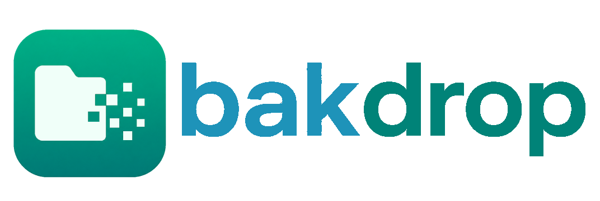
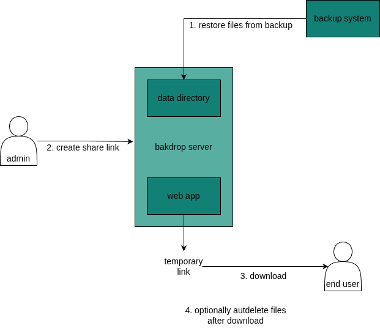

Bakdrop is a simple web app for sharing files from a server with end users through unique, self-expiring download links.

While it can be used in any case when you need to share files through web, it was built mainly for one specific job: sharing data restored from backups.

[Sometimes you can't restore straight to the target host](https://mtnt.pl/blog/en/posts/bakdrop-sharing-backups/) - you don't have agent, credentials or network access - so you need to restore the files *somewhere* and share them *somehow*. 

Bakdrop is that *somewhere and somehow*: you restore data here and share it with a link that can expire or require a password. The file can also be deleted automatically once the end user downloads it.



## Features

- **Temporary links** - random, unguessable URLs with optional expiration.
- **Password protection** - optional per-link password.
- **Automatic cleanup** - delete the file after download, or after some time.
- **Folder sharing** - folders are streamed on the fly as a ZIP.
- **Large files** - TB-scale downloads with chunked streaming and resumable transfers.

## How it works

1. An admin logs in, share a file or folder, and sends the link to the end user.
2. The end user opens link and download the data. No accounts or permissions needed.
3. File can be optionally deleted after download.

There is no web upload feature by design: Bakdrop shares files that are already on the
host, put there however you like (rsync, scp, a backup restore, ...).

## Installation

You can run Bakdrop with Docker or as a plain Apache app. You can download package from here:

https://github.com/mateusznitka/bakdrop/releases

> [!NOTE]
> Use release files instead of cloning repo.

### Option A - Docker

**Requirements:** Docker and Docker Compose.

**1. Download and extract** the latest release.

**2. Prepare the files directory on the host.**

Bakdrop serves files from a directory on the host (default `/bakdrop`). You'll want to
copy files into it without sudo, so it's easiest to make the container run as
your own user. Bind mounts match by numeric UID/GID, so check your user and group ID:

```bash
id -u   # e.g. 1000
id -g   # e.g. 1000
```
Then set directory permissions:
```bash
sudo mkdir /bakdrop
sudo chown 1000:1000 /bakdrop
chmod 750 /bakdrop
```

**3. Edit `compose.prod.yml`** and set your values:

```yaml
build:
  args:
    PUID: 1000                           # your user ID from id -u
    PGID: 1000                           # your group ID from id -g
environment:
  - BASE_URL=https://your-ip-or-domain   # used in generated links
  - DEFAULT_LANG=en                      # en or pl
  - TZ=Europe/Warsaw                     # timezone
volumes:
  - bakdrop_data:/var/lib/bakdrop        # database (named volume, auto-created)
  - /bakdrop:/bakdrop                    # your files directory on the host
```

If you leave `PUID`/`PGID` at the default (33 = www-data), you'll need `sudo` to write into `/bakdrop`.

> [!NOTE]
> You have to rebuild container and fix ownerships if you want to change PUID / PGID later. See notes below.

**4. Start it:**

```bash
docker compose -f compose.prod.yml up -d --build
```

This starts two containers: `bakdrop` (the app) and `bakdrop-cleanup` (an hourly
job that removes expired links and deletes files scheduled for deletion). The app
uses a self-signed certificate and listens on ports 80 (redirect) and 443
(HTTPS) - your browser will warn about the certificate, which is expected for
internal use. You can check the cleanup job with `docker logs bakdrop-cleanup`.

**5. Create the first admin:** open `https://your-ip-or-domain/setup.php` and
follow the prompts.

### Option B — Manual (Apache)

**Requirements:** PHP 8.3+ with the SQLite3 and mbstring extension, Apache with mod_php.

**1. Download and extract** the latest release into your web root
(e.g. `/var/www/html/bakdrop`).

**2. Configure.** Edit `config.php`:

| Setting | Default | Description |
|---|---|---|
| `DB_PATH` | `/var/lib/bakdrop/shares.db` | SQLite database file |
| `FILES_PATH` | `/bakdrop` | Root directory for shared files |
| `BASE_URL` | `https://your-domain-or-ip` | Base URL used in generated links |
| `DEFAULT_LANG` | `en` | Default language (`en` / `pl`) |
| `DEFAULT_THEME` | `dark` | Default theme (`dark` / `light`) |
| `TZ` | `Europe/Warsaw` | Timezone |

**3. Set permissions.** The web server user (`www-data`) needs read/write on the
app, the database directory, and the files directory:

```bash
sudo chown -R www-data:www-data /var/www/html/bakdrop
sudo mkdir -p /var/lib/bakdrop && sudo chown www-data:www-data /var/lib/bakdrop
sudo mkdir -p /var/log/bakdrop && sudo chown www-data:www-data /var/log/bakdrop
sudo mkdir -p /bakdrop && sudo chown www-data:www-data /bakdrop
```

**4. Set up automatic cleanup.** Add an hourly cron job, running as the web server
user so the database keeps consistent ownership:

```bash
sudo crontab -u www-data -e
```
```
0 * * * * php /var/www/html/bakdrop/cleanup.php >> /var/log/bakdrop-cleanup.log 2>&1
```

Without this, scheduled file deletion never happens. You can adjust cron check to your needs.

**5. Create the first admin:** open `http://your-domain-or-ip/setup.php`. Set up
HTTPS as you would for any Apache app.

## Managing admins

The first admin is created through the web setup page. Everything after that -
adding admins, resetting passwords, deleting accounts - is done from the command
line with `manage.php`, an interactive menu. It's meant for a "super admin" with
SSH access to the server.

Run it **as the web server user** (`www-data`) so the database keeps consistent
ownership:

```bash
# Docker
docker exec -it -u www-data bakdrop php manage.php

# Manual installation
sudo -u www-data php manage.php
```

You'll get a menu:

```
=== Bakdrop user management ===
1. List users
2. Create user
3. Reset user password
4. Change user path
5. Delete user
6. Exit
```

Type a number you want and follow the instructions.

### The admin model

Permissions are quite simple. Each admin is assigned a path within
`FILES_PATH`:

- An admin with an **empty path** sees all of `FILES_PATH` (the root).
- An admin assigned e.g. `finance` only sees and shares `/bakdrop/finance`.
- Two admins can be assigned the **same path** - they then have equal rights over
  it (each sees the other's files and shares there).

That's the whole model. Account management is
only possible from the CLI, i.e. by whoever has SSH access to the server. Regular
admins manage their own files and links through the web UI but cannot touch other
accounts.

## FAQ

**Is this a Nextcloud / WeTransfer / Filebrowser alternative?**

- No. It's intentionally minimal - sharing files by link, nothing more.

**Why is there no upload button?**

- Because Bakdrop shares files that are *already* on the host (copied there by scp,
rsync, a backup restore, ...). Getting files onto the server is a separate job.

## Notes

> **Restoring backups as root (e.g. Commvault):** if your restore tool preserves
> the original owners and permissions, some files may end up unreadable by
> Bakdrop. Either disable "restore permissions/ACLs" in the tool, or normalize
> ownership after a restore: `sudo chown -R $(id -u):$(id -g) /bakdrop/restored-folder`.

> **Reverse proxy / PHP-FPM in manual installation:** Bakdrop targets Apache with mod_php. Behind nginx
> or PHP-FPM, watch for limits that can cut off long downloads -
> `request_terminate_timeout` in the FPM pool (keep it `0`) and proxy buffering
> (`fastcgi_buffering off;` for `download.php`, or nginx may spool multi-GB
> transfers to disk).


> Because PUID/PGID are **build arguments**, changing them requires a rebuild:
> `docker compose -f compose.prod.yml up -d --build`
> **Note:** if you change `PUID`/`PGID` after the app already ran once, the
> existing `bakdrop_data` and `bakdrop_logs` volumes still belong to the old
> UID. Fix them once:
>
>     docker exec -u root bakdrop chown -R www-data:www-data /var/lib/bakdrop /var/log/bakdrop


## License

GPL-3.0 - see [LICENSE](LICENSE).

## Author

Mateusz Nitka - [mtnt.pl](https://mtnt.pl/blog)
