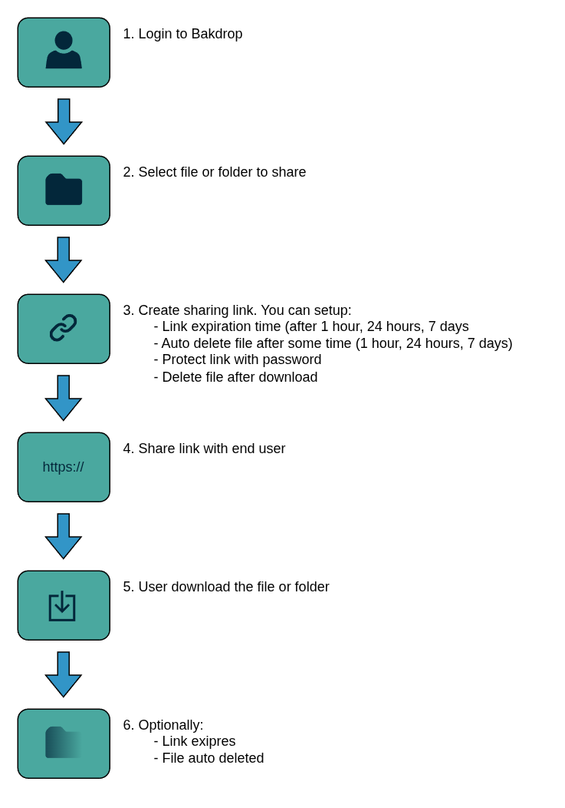

*Work in progress - BETA*

Bakdrop is simple web app for sharing files from server to end users by creating a unique download links.

The main scenario is to share data restored from backups to end users by self-expiring link with option do auto-delete data after downloading, but it can be used everywhere you need to share files from server.


The whole idea of bakdrop is just simple sharing files from your host. No users, permissions, fancy options - just link with option to download.

More about project and workflow you can read on my blog:
[MTNT Blog - ENG](https://mtnt.pl/blog/en/posts/bakdrop-sharing-backups/)

[MTNT Blog - PL](https://mtnt.pl/blog/posts/bakdrop-udostepnianie-backupow/)

## Features

- **Temporary share links** - Generate random links with optional expiration
- **Password protection** - Optionally protect links with passwords
- **Auto-deletion** - Files can be automatically deleted after download or at a scheduled time
- **Folder sharing** - Share entire folders (streamed as ZIP)
- **Efficient streaming** - Any file size, chunked streaming, pause/resume (HTTP range requests)

## Requirements

There are two options to install bakdrop - docker or manual installation.

### Docker
- Docker + Docker Compose

### Manual install
- PHP 8.3+
- SQLite3 extension for PHP
- Apache with mod_php
- Composer (for ZipStream dependency)

## Installation

### Option A — Docker

#### 1. Clone the repository

```bash
git clone https://github.com/yourusername/bakdrop.git
cd bakdrop
```

#### 2. Prepare the files directory on the host

Bakdrop shares files from a directory on the host machine (default: `/fsr`, but you can use any path).
The container needs full access to it (read, create, delete), and you want to copy
files into it **without sudo**. The cleanest way is to make the container run as *your* user.

Bind mounts resolve permissions by **numeric UID/GID**, not by user name. By default
the app inside the container runs as UID/GID 33 (www-data). You can change that at
build time with the `PUID`/`PGID` build args so it matches your host user:

**1. Find your IDs on the host:**

```bash
id -u   # e.g. 1000
id -g   # e.g. 1000
```

**2. Create the directory, owned by you:**

```bash
sudo mkdir /fsr
sudo chown user:group /fsr
chmod 750 /fsr
```

**3. Put the same values into `compose.prod.yml`** (see next step).

That's it. Everything you copy into /fsr is
automatically fully accessible to Bakdrop.

**Restoring backups as root (backup agents, e.g. Commvault):** if your restore tool
runs as root and is set to preserve original owners/permissions/ACLs, some restored
files may end up unreadable or undeletable for Bakdrop. Either disable
"restore permissions/ACLs" in the tool, or normalize ownership after each restore:

```bash
sudo chown -R user:group /fsr/restored-folder
```

#### 3. Edit compose.prod.yml

Open `compose.prod.yml` and set your values:

```yaml
environment:
  - BASE_URL=https://your-IP-or-domain   # used in generated share links
  - DEFAULT_LANG=en                       # en or pl
  - TZ=Europe/Warsaw
build:
  args:
    PUID: 1000                            # see step 2
    PGID: 1000
volumes:
  - bakdrop_data:/var/lib/bakdrop         # SQLite database (named volume, auto-created)
  - /fsr:/fsr                             # change left /fsr to your data path on host if you want different
```

#### 4. Start the containers

```bash
docker compose -f compose.prod.yml up -d
```

Compose starts two containers: `bakdrop` (the app) and `bakdrop-cleanup`, which
every hour deletes expired share links and files past their scheduled deletion
time. Check its activity with:

```bash
docker logs bakdrop-cleanup
```

The app uses a **self-signed certificate** and listens on ports 80 (redirect) and 443 (HTTPS). Your browser will warn about the certificate — this is expected for internal/self-hosted use. You can use your certificate ofc.

#### 5. Initial setup

Open https://your-IP-or-domain/setup.php in your browser and create the first admin account and follow instructions.

---

### Option B — Manual install (Apache)

#### 1. Clone or download

```bash
git clone https://github.com/yourusername/bakdrop.git
cd bakdrop
```

#### 2. Install dependencies

```bash
composer install
```

This installs `maennchen/zipstream-php` (required for folder downloads).

#### 3. Configure

Open `config.php` and edit the values directly, or set environment variables:

| Variable | Default | Description |
|---|---|---|
| DB_PATH | `/var/lib/bakdrop/shares.db` | SQLite database path |
| FILES_PATH | `/fsr` | Root directory for all shared files |
| BASE_URL | `https://your-domain-or-ip` | Base URL used in generated share links |
| DEFAULT_LANG | `en` | Default language for public pages (`en`, `pl`) |
| TZ | `Europe/Warsaw` | Timezone for expiration display |

#### 4. Set permissions

```bash
sudo chown -R www-data:www-data /path/to/bakdrop
sudo chown www-data:www-data /var/lib/bakdrop   # or wherever DB_PATH points
sudo chown www-data:www-data /fsr               # or wherever FILES_PATH points
```

#### 5. Set up automatic cleanup (cron)

Bakdrop needs a periodic job to delete expired share links and files with
a scheduled deletion time. Without it, the "auto-delete file" option never
actually deletes anything. Add a cron entry for the web server user (it must
be the same user that owns the files and the database — usually `www-data`):

```bash
sudo crontab -u www-data -e
```

```
0 * * * * php /var/www/html/bakdrop/cleanup.php >> /var/log/bakdrop-cleanup.log 2>&1
```

Files are deleted on the next cleanup run after their scheduled time, so with
an hourly cron a file can live up to 59 minutes past its deletion time. Run the
cron more often (e.g. `*/5 * * * *`) if you need tighter timing.

#### 6. Initial setup

Navigate to `http://your-domain-or-ip/setup.php` and create the first admin account.

## Usage



### For Administrators

1. **Login** - Navigate to `https://your-domain-or-ip/`
2. **Browse files** - Navigate through your assigned folder
3. **Create share link**:
   - Click "Share" next to any file or folder
   - Optionally set expiration (1h, 24h, 7 days)
   - Optionally add password protection
   - Optionally enable auto-delete after download
4. **Copy link** - Share the generated link with end users
5. **Manage shares** - View active shares, download counts, and delete links

### For End Users

End users receive a share link (e.g., `http://your-domain-or-ip/share.php?h=abc123def456`):

1. Click the link
2. Enter password if required
3. Download file or folder

## FAQ

1. Is it next Wetransfer / Nextcloud / Filebrowser? 
 - No, it's simple as possible app just for sharing files without fancy features.
2. Why there is no upload button in admin panel?
 - Because app is designed only to share data that you have already on your host, or you will copy by scp, rsync, backup restore or whatever option. 
3. What is the point of that app?
 - App is designed for specific reason - I want to safely share data restored from backups with end users. Sometimes you don't have possibility to restore data directly to some hosts (eg. you don't have credentials, restore agents, network connection) so you have to restore files "somewhere" and share them "somehow". This app is answer on this "somewhere" and "somehow". But I believe there are more use cases.

 ## Maintainer

 Mateusz Nitka - [mtnt.pl](https://mtnt.pl/blog)
